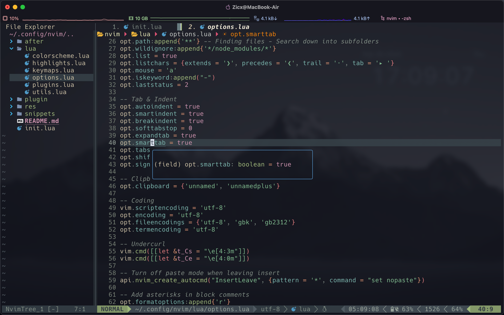

# Awesome-neovim

Here is my personal Neovim configuration. If this is helpful to you, please give me a star ⭐.

[](https://github.com/Xuer04/Awesome-neovim)

## 🏞️ Screenshots

<div align=center></div> 

## 📂 File Structure

The files under config will be **automatically loaded at the appropriate time**, so you don't need to require those files manually.

```sh
~/.config/nvim/
├── init.lua                # import neovim modules
├── after/plugin            # plugin configs
│   ├── plugin_1
│   ├── **
│   └── plugin_n
├── lua                     # core neovim configs
│   ├── colorscheme.lua
│   ├── highlights.lua
│   ├── keymaps.lua
│   ├── options.lua
│   ├── plugins.lua
│   └── utils.lua
├── res                     # user modified files
│   ├── file_1
│   ├── **
│   └── file_n
├── README.md
└── snippets                # snippets
    └── friendly-snippets
```

## ⚡️ Requirements

- [Neovim](https://github.com/neovim/neovim/releases): Neovim >= 0.8.0 (needs to be built with LuaJIT).
- [Git](https://git-scm.com/): Git >= 2.19.0 (for partial clones support).
- [Packer.nvim](https://github.com/wbthomason/packer.nvim): A use-package inspired plugin manager for Neovim.
- [Nerd Fonts](https://www.nerdfonts.com/font-downloads): Iconic font aggregator, collection, and patcher.
- [Python integration](https://neovim.io/doc/user/provider.html#provider-nodejs): To use python remote-plugins with Neovim.

    ```python
    python3 -m pip install --user pynvim
    python3 -m pip install --user neovim
    ```

- [Node.js integration](https://neovim.io/doc/user/provider.html#provider-python): To use javascript remote-plugins with Neovim.

    ```sh
    npm install -g neovim
    ```

> **Note**
>
> After you have installed all requirements, you can relaunch Neovim and type `:checkhealth` to see if your Neovim system is up-to-date.

### Optional Tools

- [Btop](https://github.com/aristocratos/btop): A monitor of resources.
- [Lazygit](https://github.com/jesseduffield/lazygit): Simple terminal UI for git commands.
- [Ranger](https://github.com/ranger/ranger): A VIM-inspired filemanager for the console.
- [Ripgrep](https://github.com/BurntSushi/ripgrep): A line-oriented search tool.

## 🛠️ Installation

1. Make a backup of your current Neovim files:

    ```sh
    # required
    mv ~/.config/nvim ~/.config/nvim.bak
    # optional but recommended
    mv ~/.local/share/nvim ~/.local/share/nvim.bak
    mv ~/.local/state/nvim ~/.local/state/nvim.bak
    mv ~/.cache/nvim ~/.cache/nvim.bak
    ```

2. Clone the repo:

    ```sh
    git clone https://github.com/Xuer04/Awesome-neovim.git ~/.config/nvim
    # remove git folder
    rm -rf ~/.config/nvim/.git
    ```

3. Install **Plugins**: Relaunch Neovim and type `:PackerInstall` to install all plugins.

4. Install **LSP Server**: Relaunch Neovim and type `:LspInstall [server]` to install corresponding LSP server.

    > To learn more about LSP servers, you can click [here](https://microsoft.github.io/language-server-protocol/implementors/servers/).

5. Install **Treesitter**: Relaunch Neovim and type `:TSInstall [language]` to install corresponding Treesitter supported-language.
 
    > To learn more about Treesitter supported-languages, you can click [here](https://github.com/nvim-treesitter/nvim-treesitter#supported-languages).

6. Start Neovim!

## ✨ Features

- Transform your Neovim into a full-fledged IDE
- Easily customize and extend your config by yourself
- Blazingly fast
- Sane default settings for options, autocmds, and keymaps
- Comes with a wealth of plugins pre-configured and ready to use

## ⌨️  Keymaps

📝 TODO

## 📖 Wiki

📝 TODO

---

Suggestions are always welcome! If you meet some problems, please contact [Zicx](https://github.com/Xuer04) or raise an [issue](https://github.com/Xuer04/Awesome-neovim/issues).

Neovim is worth a try! 😺

