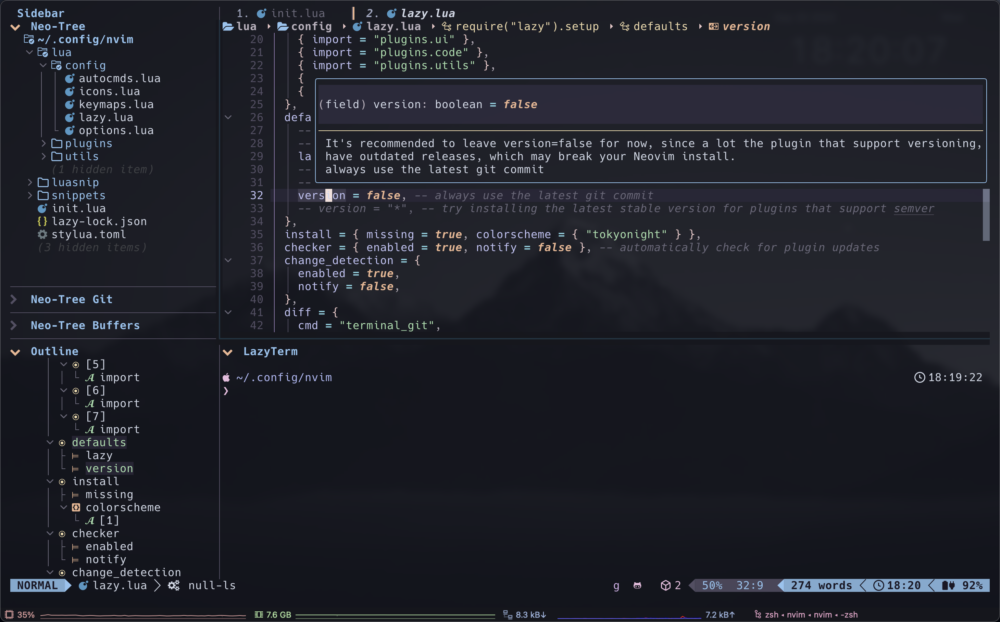

# Awesome-neovim

Here is my Neovim configuration based on [LazyVim](https://github.com/LazyVim/LazyVim). If you find it helpful, please giving me a star⭐, thanks.

[](https://github.com/cxzhou35/Awesome-neovim)

## Table of contents

<!--toc:start-->
- [Awesome-neovim](#awesome-neovim)
  - [Table of contents](#table-of-contents)
  - [🏞️ Screenshots](#🏞️-screenshots)
  - [📂 File Structure](#📂-file-structure)
  - [⚡️ Requirements](#️-requirements)
    - [Optional Tools](#optional-tools)
  - [🛠️ Installation](#🛠️-installation)
  - [✨ Features](#features)
  - [⌨️  Keymaps](#️-keymaps)
  - [📖 Wiki](#📖-wiki)
<!--toc:end-->

## 🏞️ Screenshots

<div align=center></div>

## 📂 File Structure

The files under config will be **automatically loaded at the appropriate time**, so you don't need to require those files manually.

<details>
<summary>Click to toggle contents of whole file structure</summary>

```sh
~/.config/neovim/
├── lua
│   ├── config               # neovim modules
│   │   ├── autocmds.lua
│   │   ├── icons.lua
│   │   ├── keymaps.lua
│   │   ├── lazy.lua
│   │   └── options.lua
│   ├── plugins              # plugin configs
│   │   ├── code
│   │   ├── colorscheme
│   │   ├── disabled.lua
│   │   ├── editor
│   │   ├── ui
│   │   └── utils
│   └── utils                # filetype settings
│       ├── init.lua
│       └── latex.lua
├── luasnip                  # code snippets
│   ├── all.lua
│   ├── lua.lua
│   ├── markdown
│   │   ├── math.lua
│   │   └── text.lua
│   └── tex
│       ├── completion.lua
│       ├── font.lua
│       ├── greek-letter.lua
│       ├── matrix.lua
│       └── ...
└── init.lua
```

</details>

## ⚡️ Requirements

- [Neovim](https://github.com/neovim/neovim/releases): Neovim >= 0.8.0 (needs to be built with LuaJIT).
- [Git](https://git-scm.com/): Git >= 2.19.0 (for partial clones support).
- [Lazy.nvim](https://github.com/LazyVim/LazyVim): 💤 A modern plugin manager for Neovim.
- [Nerd Fonts](https://www.nerdfonts.com/font-downloads): Iconic font aggregator, collection, and patcher.
- [Python integration](https://neovim.io/doc/user/provider.html#provider-nodejs): To use python remote-plugins with Neovim.

    ```python
    python3 -m pip install --user pynvim
    python3 -m pip install --user neovim
    ```

- [Node.js integration](https://neovim.io/doc/user/provider.html#provider-python): To use javascript remote-plugins with Neovim.

    ```sh
    npm install -g neovim
    ```

- A terminal that support true color and undercurl:
  - kitty **(Linux & Macos)**
  - wezterm **(Linux, Macos & Windows)**
  - alacritty **(Linux, Macos & Windows)**
  - iterm2 **(Macos)**

> **Note**
>
> Once you have installed all the necessary requirements, relaunch Neovim and type `:checkhealth` to ensure that your system is up-to-date.

### Optional Tools

- [Btop](https://github.com/aristocratos/btop): A monitor of resources.
- [Lazygit](https://github.com/jesseduffield/lazygit): Simple terminal UI for git commands.
- [Ranger](https://github.com/ranger/ranger): A VIM-inspired filemanager for the console.
- [Ripgrep](https://github.com/BurntSushi/ripgrep): A line-oriented search tool.

## 🛠️ Installation

1. Make a backup of your current Neovim files:

    ```sh
    # required
    mv ~/.config/nvim ~/.config/nvim.bak
    # optional but recommended
    mv ~/.local/share/nvim ~/.local/share/nvim.bak
    mv ~/.local/state/nvim ~/.local/state/nvim.bak
    mv ~/.cache/nvim ~/.cache/nvim.bak
    ```

2. Clone the repo:

    ```sh
    git clone https://github.com/cxzhou35/Awesome-neovim.git ~/.config/nvim
    
    git checkout lazy
    # remove git folder
    rm -rf ~/.config/nvim/.git
    ```

3. Install **Plugins**: Relaunch Neovim and type `:Lazy` to sync all plugins.

4. Install **LSP Server**: Relaunch Neovim and type `:LspInstall [server]` to install corresponding LSP server.

    > You can learn more about LSP servers [here](https://microsoft.github.io/language-server-protocol/implementors/servers/).

5. Install **Treesitter**: Relaunch Neovim and type `:TSInstall [language]` to install corresponding Treesitter supported-language.

    > You can learn more about Treesitter supported-languages [here](https://github.com/nvim-treesitter/nvim-treesitter#supported-languages).

6. Start Neovim!

## ✨ Features

- 🔥 Transform your Neovim into a full-fledged IDE
- 💤 Easily customize and extend your config with lazy.nvim
- 🚀 Blazingly fast
- 🧹 Sane default settings for options, autocmds, and keymaps
- 📦 Comes with a wealth of plugins pre-configured and ready to use

## ⌨️  Keymaps

📝 TODO

## 📖 Wiki

📝 TODO

---

Suggestions are always welcome! If you encounter any issues, please contact [Zicx](https://github.com/cxzhou35) or raise an [issue](https://github.com/cxzhou35/Awesome-neovim/issues).

Neovim is worth to try! 😺
